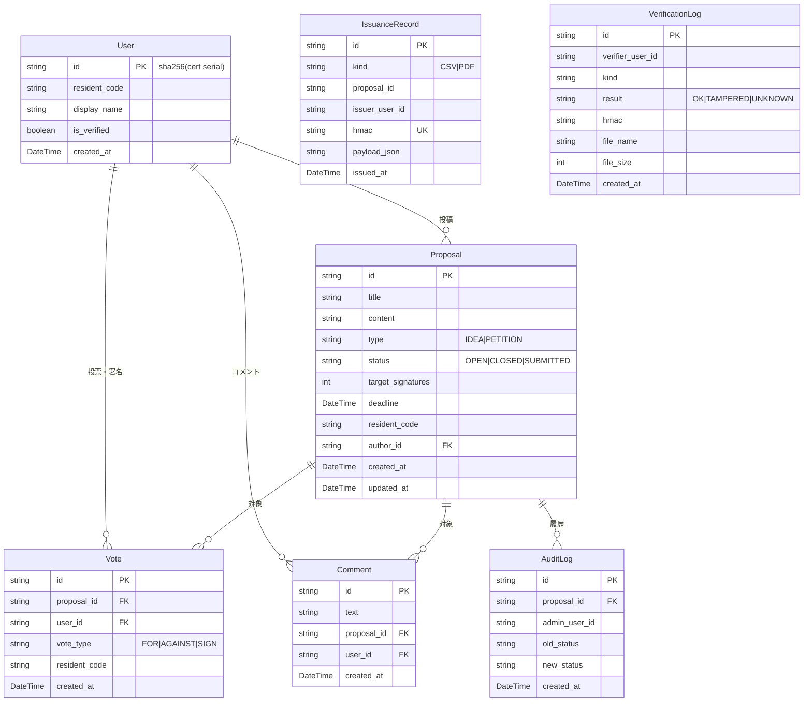
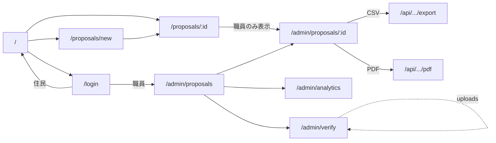
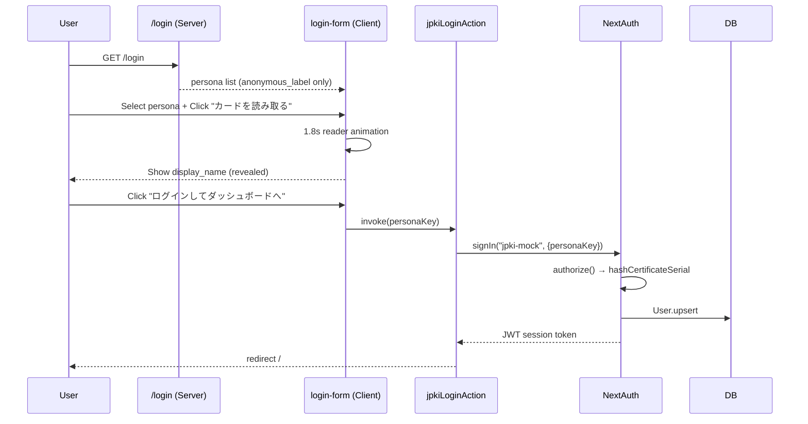
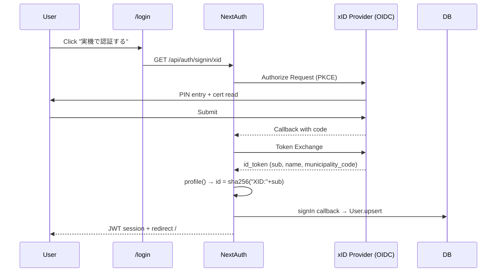

# ローカル・コンパクトシティ 住民提案・デジタル署名プラットフォーム 設計書

| 項目 | 内容 |
|---|---|
| 文書名 | ローカル・コンパクトシティ 住民提案・デジタル署名プラットフォーム 設計書 |
| バージョン | 1.0 |
| 作成日 | 2026-05-10 |
| 対象システム | プロトタイプ／コンセプト実証 (PoC) |
| 配置 | `docs/設計書.md` |

---

## 目次

1. [はじめに](#1-はじめに)
2. [システム概要](#2-システム概要)
3. [アーキテクチャ](#3-アーキテクチャ)
4. [データモデル](#4-データモデル)
5. [機能仕様](#5-機能仕様)
6. [画面設計](#6-画面設計)
7. [API / Server Action 仕様](#7-api--server-action-仕様)
8. [認証・認可設計](#8-認証認可設計)
9. [マルチテナント設計](#9-マルチテナント設計)
10. [セキュリティ設計](#10-セキュリティ設計)
11. [監査・証跡設計](#11-監査証跡設計)
12. [非機能要件](#12-非機能要件)
13. [デプロイ・運用設計](#13-デプロイ運用設計)
14. [既知の制約と本番化ロードマップ](#14-既知の制約と本番化ロードマップ)
- [付録 A. 用語集](#付録-a-用語集)
- [付録 B. 自治体マスタ](#付録-b-自治体マスタ)
- [付録 C. 改訂履歴](#付録-c-改訂履歴)

---

## 1. はじめに

### 1.1 文書の目的

本書は、地域住民が自治体に対して**マイナンバーカード（JPKI）認証付きの電子署名**で請願・提案を行うプラットフォームの設計を、開発・運用・評価の各関係者が共通理解を持てる粒度で記述する。

### 1.2 対象読者

| 読者 | 主に参照する章 |
|---|---|
| 自治体 IT 担当・調達担当 | 1, 2, 8, 10, 11, 13, 14 |
| 評価ベンダー・監査人 | 4, 7, 8, 10, 11 |
| 開発担当・引継ぎ要員 | 3, 4, 5, 6, 7, 9, 13 |
| プロジェクトマネージャ | 1, 2, 12, 14 |

### 1.3 関連文書

| 文書 | 役割 |
|---|---|
| [`README.md`](../README.md) | デモ実演台本・セットアップ手順 |
| [`prisma/schema.prisma`](../prisma/schema.prisma) | DB スキーマ正本 |
| `prisma/migrations/` | DDL 履歴（不可逆） |

---

## 2. システム概要

### 2.1 解決する課題

| 行政・社会課題 | 本システムの解決アプローチ |
|---|---|
| 紙ベースの請願は集約・保管コストが高い | デジタル投稿 + 自動集計 + 公文書品質 PDF 出力 |
| ネット署名は本人性が証明できない | JPKI による**居住確認済み**電子署名 |
| 配布された電子文書の改ざんを検知できない | HMAC-SHA256 を文書に埋め込み、**サーバ側で再検証可能** |
| 行政が市民の関心を肌感で把握できない | 統計ダッシュボード（時系列・属性別） |
| マイナンバーの取扱い不安 | **マイナンバー本体は一切取得しない**設計 |

### 2.2 スコープ

#### スコープ内

- 住民による「アイデア（IDEA）」「請願（PETITION）」の投稿
- マイナンバーカードを使った（モック）認証
- 賛否表明・電子署名・コメント
- 自治体職員向け管理画面（ステータス管理）
- CSV / PDF エクスポート（改ざん検知対応）
- 統計ダッシュボード
- 原本性検証ページ
- マルチテナント（複数自治体共存）
- 監査ログ・発行台帳・検証履歴

#### スコープ外

- 実機 JPKI 連携（接続スタブのみ用意）
- メール / プッシュ通知
- 多言語化（i18n）
- モバイルアプリ
- 公開鍵署名（ECDSA / Ed25519）への移行
- WORM ストレージ統合

### 2.3 主要ユースケース

| ID | アクター | ユースケース |
|---|---|---|
| UC-01 | 住民 | マイナンバーカードで認証する |
| UC-02 | 住民 | 自治体に提案・請願を投稿する |
| UC-03 | 住民 | 提案に賛同・反対する（IDEA） |
| UC-04 | 住民 | 請願に電子署名する（PETITION） |
| UC-05 | 住民 | 提案にコメントを投稿する |
| UC-06 | 自治体職員 | 自治体内の提案を一覧・管理する |
| UC-07 | 自治体職員 | 提案のステータスを変更する |
| UC-08 | 自治体職員 | CSV / PDF 報告書を発行する |
| UC-09 | 自治体職員 | 統計ダッシュボードで活動量を把握する |
| UC-10 | 他部署職員 | 受け取った CSV / PDF の原本性を検証する |

---

## 3. アーキテクチャ

### 3.1 全体構成

```mermaid
flowchart TB
  subgraph Client[クライアント (Browser)]
    UI[Next.js App Router UI<br/>shadcn/ui + Tailwind]
    Charts[Recharts<br/>Client Component]
  end

  subgraph Edge[Edge Runtime]
    MW[middleware = proxy.ts<br/>NextAuth 認可ガード]
  end

  subgraph Node[Node Runtime]
    SA[Server Actions]
    RH[Route Handlers<br/>/api/admin/*]
    Auth[NextAuth.js v5]
    JPKI[JPKI モック / xID OIDC]
    PDF[react-pdf renderer<br/>+ Noto Sans JP]
    HMAC[crypto.HMAC]
    PDFLib[pdf-lib<br/>metadata 解析]
  end

  subgraph Data[Data Layer]
    Prisma[Prisma Client]
    DB[(SQLite<br/>dev.db)]
    Fonts[(public/fonts/<br/>NotoSansJP-Regular.otf)]
  end

  UI -->|HTTPS| MW
  MW -->|認可OK| SA
  MW -->|認可OK| RH
  UI -->|invokeAction| SA
  UI -->|fetch| RH
  SA --> Auth
  RH --> Auth
  Auth --> JPKI
  RH --> PDF
  RH --> HMAC
  RH --> PDFLib
  SA --> Prisma
  RH --> Prisma
  Prisma --> DB
  PDF --> Fonts
  Charts -.props.-> UI
```

### 3.2 技術選定

| レイヤ | 採用技術 | 選定理由 |
|---|---|---|
| Frontend | Next.js 16 (App Router, Turbopack) | Server Components で初期表示の軽量化、Server Actions で API 層を薄く |
| UI ライブラリ | shadcn/ui + Tailwind v4 | コード化されたコンポーネントでカスタマイズ容易、デザインシステムの統一 |
| 言語 | TypeScript 5 | 型による契約、リファクタリング安全性 |
| Auth | NextAuth.js v5 (Auth.js) | OIDC 対応、JWT/DB セッション切替自由、業界標準 |
| ORM | Prisma 6 | 型安全、マイグレーション管理、トランザクション API |
| DB | SQLite（プロト）→ PostgreSQL（本番想定） | プロトの開発容易性、PG 移行は接続文字列のみ |
| PDF | @react-pdf/renderer v4 | React コンポーネントで PDF を組める、レイアウト保守性 |
| グラフ | Recharts v3 | 宣言的、Server-rendered props と相性◎、SVG ベース |
| PDF 解析 | pdf-lib | metadata 読み取りが軽量、純 JS |

### 3.3 レイヤ分離方針

| レイヤ | 責務 | 例 |
|---|---|---|
| **Edge** | URL ベースの認可ガードのみ。crypto 等は持ち込まない | [`src/proxy.ts`](../src/proxy.ts), [`src/auth.config.ts`](../src/auth.config.ts) |
| **Node Server** | DB アクセス、PDF 生成、HMAC 計算、JPKI 認証 | [`src/auth.ts`](../src/auth.ts), Route Handlers |
| **Client** | ユーザインタラクション、ローカル状態、可視化 | login-form.tsx、charts.tsx |
| **Pure Data** | 自治体マスタ、enum 定数 | [`src/lib/constants.ts`](../src/lib/constants.ts) |

Edge ⇄ Node の境界は `auth.config.ts`（edge-safe）と `auth.ts`（Node-only）に分離。Client ⇄ Server の境界は `'use client'` の明示と `import type` の徹底で守る。

---

## 4. データモデル

### 4.1 ER 図



### 4.2 テーブル詳細

#### 4.2.1 User

| カラム | 型 | 制約 | 説明 |
|---|---|---|---|
| `id` | String | PK | `sha256(certificate_serial)` 不可逆ハッシュ |
| `resident_code` | String | NOT NULL | 6 桁自治体コード（JIS X 0402 ベース） |
| `display_name` | String? | NULL 可 | JPKI から取得した氏名（任意） |
| `is_verified` | Boolean | DEFAULT true | JPKI 認証経由なら常に true |
| `created_at` | DateTime | DEFAULT now | |

インデックス: `@@index([resident_code])`

**設計上の重要点**：
- `id` は**不可逆ハッシュ**であり、マイナンバー（個人番号）から復元不可
- `display_name` は表示用のみ。同姓同名の住民区別は `id` で行う

#### 4.2.2 Proposal

| カラム | 型 | 説明 |
|---|---|---|
| `id` | cuid PK | |
| `title`, `content` | String | 提案内容 |
| `type` | "IDEA" / "PETITION" | 軽い提案か正式請願か |
| `status` | "OPEN" / "CLOSED" / "SUBMITTED" | ライフサイクル状態 |
| `target_signatures` | Int | 請願の目標署名数（IDEA は 0） |
| `deadline` | DateTime? | 任意 |
| `resident_code` | String | **テナント識別子** |
| `author_id` | FK→User.id | |

インデックス: `@@index([type, status])`, `@@index([resident_code])`

#### 4.2.3 Vote

| カラム | 型 | 説明 |
|---|---|---|
| `id` | cuid PK | |
| `proposal_id` | FK→Proposal.id, ON DELETE CASCADE | |
| `user_id` | FK→User.id, ON DELETE CASCADE | |
| `vote_type` | "FOR" / "AGAINST" / "SIGN" | |
| `resident_code` | String | **署名時点のスナップショット**（後日の引越し等に影響されない） |
| `created_at` | DateTime | |

**制約**: `@@unique([proposal_id, user_id])` — DB レベルで二重投票防止

#### 4.2.4 Comment

| カラム | 型 | 説明 |
|---|---|---|
| `id` | cuid PK | |
| `text` | String | 400 文字以内（アプリ側制約） |
| `proposal_id` | FK→Proposal.id | |
| `user_id` | FK→User.id | |
| `created_at` | DateTime | |

**プライバシー方針**: UI 出力時に `user_id` を含めず、SELECT 句から除外。

#### 4.2.5 AuditLog（append-only）

| カラム | 型 | 説明 |
|---|---|---|
| `id` | cuid PK | |
| `proposal_id` | FK→Proposal.id | |
| `admin_user_id` | String | 操作した職員のハッシュ ID |
| `old_status` | String | 変更前 |
| `new_status` | String | 変更後 |
| `created_at` | DateTime | |

**運用ルール**: アプリケーション層は **UPDATE / DELETE メソッドを提供しない**。

#### 4.2.6 IssuanceRecord（発行台帳、append-only）

| カラム | 型 | 説明 |
|---|---|---|
| `id` | cuid PK | |
| `kind` | "CSV" / "PDF" | |
| `proposal_id` | String | |
| `issuer_user_id` | String | 発行した職員のハッシュ ID |
| `hmac` | String UNIQUE | 文書の HMAC-SHA256 ダイジェスト |
| `payload_json` | String | HMAC の入力となった正規化 JSON |
| `issued_at` | DateTime | |

#### 4.2.7 VerificationLog（検証履歴、append-only）

| カラム | 型 | 説明 |
|---|---|---|
| `id` | cuid PK | |
| `verifier_user_id` | String | 検証を実行した職員のハッシュ ID |
| `kind` | "CSV" / "PDF" / "UNKNOWN" | |
| `result` | "OK" / "TAMPERED" / "UNKNOWN" | |
| `hmac` | String? | ファイルから抽出した HMAC |
| `file_name`, `file_size` | String?, Int? | |
| `created_at` | DateTime | |

---

## 5. 機能仕様

### 5.1 機能一覧

| ID | 機能 | アクター | 入力 | 主な制約 |
|---|---|---|---|---|
| F-01 | JPKI 認証ログイン | 住民/職員 | ペルソナ選択（モック）/ xID OIDC（実機） | マイナンバー本体は取得しない |
| F-02 | 提案投稿 | 認証済み住民 | タイトル・本文・種別・目標 | 種別ごとに項目バリデーション |
| F-03 | 賛否表明（IDEA） | 同 | 提案 ID / FOR・AGAINST | 自治体一致、二重防止 |
| F-04 | 電子署名（PETITION） | 同 | 提案 ID + 確認チェック | 同上 + 同意宣言必須 |
| F-05 | コメント投稿 | 同 | 提案 ID + 本文（400 字） | trim 後 1〜400 字 |
| F-06 | 提案管理ダッシュボード | 職員 | — | 自治体スコープで自動絞り込み |
| F-07 | ステータス変更 | 職員 | 提案 ID + 新ステータス | トランザクション + 監査ログ |
| F-08 | CSV エクスポート | 職員 | 提案 ID | PETITION のみ、HMAC 付与 |
| F-09 | PDF レポート | 職員 | 提案 ID | PETITION のみ、HMAC をフッターと metadata に埋込 |
| F-10 | 統計ダッシュボード | 職員 | — | テナントスコープ |
| F-11 | 原本性検証 | 職員 | ファイル | CSV / PDF、3 段階照合 |
| F-12 | 行政レポート（公開） | 全員 | — | 公開請願の集計表示 |
| F-13 | xID 連携（スタブ） | 住民 | OIDC コールバック | env で有効化 |

### 5.2 主要機能の詳細

#### F-04 電子署名（PETITION）の処理フロー

```
1. ユーザが該当ページで「住民として賛同します」チェックを ON
2. 「電子署名する」ボタン押下 → Server Action castVoteAction 呼出
3. 認証チェック（session 取得）
4. zod でフォーム検証
5. Proposal を取得し以下を確認:
   - 存在
   - status === "OPEN"
   - 自治体一致（proposal.resident_code === session.user.resident_code）
   - 種別と vote_type の整合
   - 確認チェック attest === "1"
   - 締切未経過
6. prisma.vote.create
   ├ 成功: revalidatePath → UI 更新
   └ P2002: 「既に署名済み」を返却
```

#### F-09 PDF レポート発行

```
1. 職員が /admin/proposals/[id] で「PDF報告書」リンク
2. /api/admin/proposals/[id]/pdf にアクセス
3. isAdmin(session) + 自治体一致 + PETITION 限定チェック
4. Proposal + 関連 Vote(SIGN) を取得し集計
5. issuedAt = new Date() を確定
6. payloadCanonical = canonicalize(buildHmacPayload(...))
7. hmac = hmacHex(payloadCanonical)
8. IssuanceRecord.upsert（hmac で一意）
9. renderToBuffer(<PetitionReport data={{...,hmac,issuedAt}}/>)
10. Content-Type: application/pdf でストリーム返却
```

#### F-11 原本性検証

```
CSV:
  ┌ 末尾 # HMAC-SHA256: <hex> の行をプレフィックス緩マッチで検出
  ├ 値が 64 桁 hex かを別途検証
  │   ├ NG → TAMPERED
  │   └ OK ↓
  ├ 行を除いた body を hmacHex() で再計算
  ├ safeEqualHex() で定数時間比較
  │   ├ 不一致 → TAMPERED
  │   └ 一致 ↓
  ├ IssuanceRecord をヒット試行
  └ VerificationLog.create → OK 結果返却

PDF:
  ┌ pdf-lib で Keywords metadata 取得
  ├ "hmac=<hex>" 抽出
  ├ IssuanceRecord.findUnique({where:{hmac}})
  │   ├ 不在 → TAMPERED
  │   └ あり ↓
  ├ payload_json から HMAC 再計算
  ├ safeEqualHex で比較
  │   ├ 不一致 → TAMPERED
  │   └ 一致 → OK
  └ VerificationLog.create
```

---

## 6. 画面設計

### 6.1 画面一覧

| パス | 画面名 | 認可 | 種別 |
|---|---|---|---|
| `/` | 提案一覧（ホーム） | 公開 / 認証で絞込 | 住民向け |
| `/login` | ログイン | 公開 | 住民向け |
| `/proposals/new` | 提案投稿 | 認証必須 | 住民向け |
| `/proposals/[id]` | 提案詳細 + コメント | 公開（投票は認証） | 住民向け |
| `/report` | 行政レポート一覧 | 公開 | 公開 |
| `/report/[id]` | 行政レポート詳細 | 公開 | 公開 |
| `/admin/proposals` | 管理ダッシュボード | 職員のみ | 行政 |
| `/admin/proposals/[id]` | 個別管理 + 履歴 | 職員のみ | 行政 |
| `/admin/analytics` | 統計 | 職員のみ | 行政 |
| `/admin/verify` | 原本性検証 | 職員のみ | 行政 |
| `/admin/forbidden` | 非職員フォールバック | 認証必須 | 行政 |

### 6.2 画面遷移



### 6.3 主要画面の構成

#### 6.3.1 ログイン画面

```
┌──────────────────────────────────────┐
│  マイナンバーカードでログイン        │
│  （プライバシー説明文）              │
├──────────────────────────────────────┤
│  🪪 実機で認証する（xID 連携）       │ ← env で有効化時のみ活性
│  [マイナンバーカードで実機認証する]  │
├── または デモ用モック ─────────────┤
│  🟠 プロトタイプ用モック             │
├──────────────────────────────────────┤
│  読み取りカードを選択 [▼ Select]    │
│  ┌ 区内住民                        │
│  ├ 区外住民                        │
│  └ 自治体職員                      │
│  [── カードを読み取る ──]            │
└──────────────────────────────────────┘
```

リーダ・アニメーション中 → 4 ステップ進捗 → 緑ボックスに**実名表示** → 「ログインしてダッシュボードへ」明示クリック → / へ遷移。

#### 6.3.2 提案詳細画面

```
┌──────────────────────────────────────┐
│ [請願] 東京都千代田区 投稿者:山田太郎 │
│ タイトル                              │
│ 本文                                  │
├──── 電子署名で意思表示する ────────┤
│ 進捗バー  100 / 500 筆 (20%)         │
│ ☐ 私はこの自治体の住民として賛同…   │
│ [電子署名する]  ※ 1 人 1 回           │
├──── みんなの声（コメント） [3] ────┤
│ 🧍 ある住民 認証済み  3 時間前      │
│   コメント本文                        │
│ 🧍 ある住民 認証済み  2 日前        │
│   ...                                 │
│ [Textarea] [コメントを投稿]          │
└──────────────────────────────────────┘
```

#### 6.3.3 管理ダッシュボード

```
┌──────────────────────────────────────┐
│ バックオフィス｜提案管理             │
│ 東京都千代田区 の管轄下の提案を表示  │
├─種別─┬─タイトル─┬─状態─┬─集計─┬─操作─┤
│ 請願 │ 自転車…  │ 受付中│ 300/500 │ [更新▼][詳細・履歴][CSV][PDF] │
│      │          │      │ 📈sparkline│                                │
│ アイデア │ 図書館…│ 受付中│ 賛 5・反 1 │ [更新▼][詳細・履歴]           │
└──────┴──────────┴──────┴──────┴───────┘
```

#### 6.3.4 統計ダッシュボード

```
KPI バー: [提案数] [請願数] [行政受付済] [累計署名数]
請願ごとのカード × N:
  ┌─請願タイトル─────────────────┐
  │ 日別/累積（Area）  自治体別（Pie）│
  └──────────────────────────────────┘
```

---

## 7. API / Server Action 仕様

### 7.1 Server Actions

| 関数 | 入力 | 出力 | 主な失敗 |
|---|---|---|---|
| `jpkiLoginAction(formData)` | personaKey | redirect | persona 不在 |
| `logoutAction()` | — | redirect | — |
| `createProposalAction(prev, formData)` | title, content, type, target, deadline | `{ ok?, error?, fieldErrors? }` | 認証なし、バリデーションエラー |
| `castVoteAction(prev, formData)` | proposalId, voteType, attest | `{ ok?, error? }` | 認証なし、自治体不一致、二重投票（P2002）、締切経過 |
| `postCommentAction(prev, formData)` | proposalId, text | `{ ok?, error? }` | 文字数超過、空文字 |
| `updateProposalStatusAction(prev, formData)` | proposalId, status | `{ ok?, error? }` | 非職員、他自治体、トランザクション失敗 |
| `verifyExportAction(formData)` | file | `VerifyResult` | 非職員、サイズ超過、形式不明 |

### 7.2 Route Handlers

| メソッド+パス | 認可 | 入力 | 出力 |
|---|---|---|---|
| `GET /api/admin/proposals/[id]/export` | 職員 | path id | text/csv (HMAC 付き) |
| `GET /api/admin/proposals/[id]/pdf` | 職員 | path id | application/pdf (HMAC 付き) |
| `GET/POST /api/auth/[...nextauth]` | — | NextAuth 標準 | リダイレクト等 |

### 7.3 castVoteAction レスポンス例

```json
// 成功
{ "ok": true }

// 自治体不一致
{ "error": "他自治体の提案には署名・投票できません。お住まいの自治体の提案のみご参加いただけます。" }

// 二重投票
{ "error": "この提案には既に投票/署名済みです。1人につき1回のみ可能です。" }
```

---

## 8. 認証・認可設計

### 8.1 認証フロー（モック JPKI）



### 8.2 認証フロー（xID 実機・スタブ）



### 8.3 認可方針

#### 8.3.1 多層防御

| 層 | 担当 | 実装 |
|---|---|---|
| 1. Edge Middleware | URL ベースの粗い遮断 | [`proxy.ts`](../src/proxy.ts) + `authConfig.authorized` |
| 2. Server Component | ページ表示前の再検証 | `redirect("/admin/forbidden")` |
| 3. Server Action / Route Handler | 操作実行前の最終チェック | `isAdmin()` + 自治体一致 |

#### 8.3.2 ロール

| ロール | 識別方法 | 権限 |
|---|---|---|
| 未認証 | session === null | 公開ページのみ閲覧 |
| 一般住民 | session.user.id && ¬admin | 自治体内提案の表示・投稿・投票・コメント |
| 職員 | session.user.id ∈ `ADMIN_USER_IDS` | 自治体内提案の管理・出力・検証 |

`ADMIN_USER_IDS` は edge-safe にするため、ハッシュを **precomputed constants** として保持する（[`src/lib/admin.ts`](../src/lib/admin.ts)）。

### 8.4 セッション戦略

- **JWT 戦略**を採用（`session: { strategy: "jwt" }`）
- 理由：
  - サーバ間の状態共有不要 → 将来の水平スケール時に有利
  - DB セッション読み出しレイテンシなし
- 拡張クレーム：`uid`, `resident_code`, `is_verified`

---

## 9. マルチテナント設計

### 9.1 テナント識別

**テナント = 自治体（municipality）**。ユーザの `resident_code`（6 桁）がテナント識別子となる。

- 単一プラットフォーム上で複数自治体が共存
- 自治体の追加は `MUNICIPALITIES` マスタへの 1 行追加 + 必要なら職員ペルソナ
- DB は単一インスタンス（行レベルで分離）

### 9.2 テナント分離の階層

| 層 | 分離手段 |
|---|---|
| **UI フィルタ** | 提案一覧で `where: { resident_code: session.user.resident_code }` |
| **投稿時** | Server Action が `resident_code` を session から自動付与（クライアント注入不可） |
| **投票・署名時** | `proposal.resident_code === session.user.resident_code` を必須化 |
| **管理時** | 管理 Action 内で同上のチェック |
| **エクスポート時** | Route Handler 内で同上 |

### 9.3 越境シナリオの扱い

| シナリオ | 挙動 |
|---|---|
| 千代田区民が盛岡市の URL を直接叩く（閲覧） | 公開情報として閲覧可（透明性重視） |
| 千代田区民が盛岡市の請願に署名しようとする | Server Action が 403 相当のエラー返却 |
| 千代田区職員が盛岡市の管理画面を URL 直叩き | 一覧から消える + 個別ページは notFound() |

---

## 10. セキュリティ設計

### 10.1 個人情報の最小化

#### 10.1.1 マイナンバーは取得しない

JPKI から取得可能な情報のうち、本システムが**実装上参照しない**もの：
- マイナンバー（12 桁）
- 性別・生年月日（プライバシー上不要）

#### 10.1.2 不可逆ハッシュ化

```
証明書シリアル番号 → SHA-256 → User.id に保存
                              ↑ 元値復元は計算量的に不可能
```

実装: [`src/lib/jpki-mock.ts`](../src/lib/jpki-mock.ts) `hashCertificateSerial()`

#### 10.1.3 表示時のフィルタ

| 場所 | 表示内容 |
|---|---|
| コメント一覧 | 「ある住民」+ 認証済みバッジ + 相対日時のみ |
| 監査ログ | 操作者 ID 先頭 8 文字 + `…` |
| CSV エクスポート | `user_id_hashed`（既にハッシュ済） |
| PDF レポート | 統計値のみ。個別の署名者情報は含まれない |

### 10.2 改ざん検知（HMAC-SHA256）

#### 10.2.1 CSV

```
ファイル末尾に `# HMAC-SHA256: <64桁hex>` 行を追加。
入力: BOM + プレアンブル + ヘッダー + データ行 (\r\n 終端)
```

#### 10.2.2 PDF

```
PDF Document の Keywords metadata に
`hmac=<hex>;proposalId=<id>;issuedAt=<ISO>` を設定。
フッターにも「文書検証用ハッシュ」として hex を印字。
入力: buildHmacPayload() が返す正規化 JSON
  { v:1, proposalId, title, status, residentCode,
    targetSignatures, totalSignatures, verifiedCount,
    localSignerCount, firstSignatureAt, lastSignatureAt, issuedAt }
```

#### 10.2.3 検証強度

- 鍵は `EXPORT_HMAC_SECRET`（環境変数、サーバのみ保持）
- HMAC は**衝突困難**：32 バイトキー + SHA-256 で実質的に偽造不可
- 比較は `crypto.timingSafeEqual` でタイミング攻撃耐性

### 10.3 SQL インジェクション

Prisma を介すため、文字列連結による SQL は存在しない。すべて**パラメータ化クエリ**。

### 10.4 CSRF

- Server Actions は Next.js が自動的に **`Action ID`** ヘッダで識別、CSRF トークンは内部処理
- NextAuth の OAuth/OIDC フローは PKCE + state を標準で使用

### 10.5 XSS

- React のデフォルト出力エスケープ（`{}` 内）に依拠
- `dangerouslySetInnerHTML` は本実装で**未使用**
- 提案本文は `whitespace-pre-wrap` で表示するが、HTML を解釈しない

---

## 11. 監査・証跡設計

### 11.1 監査ログ三層

| テーブル | 何を記録 | 監査が答えられる質問 |
|---|---|---|
| `AuditLog` | 提案ステータス変更 | 「誰が・いつ・どの状態に変えたか」 |
| `IssuanceRecord` | CSV/PDF 発行 | 「いつ・誰が・どんな内容で文書を出したか」 |
| `VerificationLog` | 検証実行 | 「誰が・いつ・どのファイルを・どう判定したか」 |

### 11.2 Append-only 原則

- いずれのテーブルもアプリ層から **UPDATE / DELETE 関数を提供しない**
- 「動かない記録」が積み上がることで内部不正・運用ミスの追跡が可能になる
- 本番化時は **PostgreSQL の ROW-level security** + **トリガでの UPDATE 拒否** を併用推奨

### 11.3 トランザクションによる原子性

ステータス変更時の処理：

```typescript
await prisma.$transaction(async (tx) => {
  const before = await tx.proposal.findUnique(...)
  if (before.status === newStatus) return  // no-op
  await tx.proposal.update(...)
  await tx.auditLog.create({...})  // ← 必ずペアで発行
})
```

部分失敗で「変更したのに監査ログがない」状態は構造上発生しない。

### 11.4 検証可能性

CSV / PDF の HMAC を埋め込み + 発行台帳保持により、行政側受領部門が「**この文書は本当に発行された原本か**」を**追加サーバなしで証明**できる。

---

## 12. 非機能要件

### 12.1 性能

| 指標 | 目標値（プロト） | 本番化時の目安 |
|---|---|---|
| ページ初期表示 | < 2 秒 | < 1 秒 |
| Server Action 応答 | < 500ms | < 200ms |
| PDF 生成 | < 3 秒（初回フォントロード含む） | < 2 秒 |
| HMAC 計算 | < 10ms / KB | 同左 |

### 12.2 可用性

- プロトはローカル単一プロセス
- 本番想定: SLA 99.5%（業務系として標準）

### 12.3 スケーラビリティ

| 軸 | 限界（現状） | 拡張方向 |
|---|---|---|
| 自治体数 | 制限なし（マスタ追加のみ） | 全国 1,718 自治体まで対応可能設計 |
| 同時接続 | 単一 Node プロセス | Vercel/Cloud Run + DB プール |
| データ量 | SQLite ファイル | PostgreSQL（推定 100 万署名/年でも余裕） |

### 12.4 アクセシビリティ

- semantic HTML（`<button>`, `<form>`, `<ol>` 等）
- `aria-label` 主要操作に付与
- カラーコントラスト：ダークモード対応
- スクリーンリーダ向けに `aria-live` で動的領域を通知

---

## 13. デプロイ・運用設計

### 13.1 環境構成

| 環境 | 用途 | DB | 認証 |
|---|---|---|---|
| ローカル | 開発 | SQLite | JPKI モック |
| ステージング | 検証 | PostgreSQL | xID テストエンドポイント |
| 本番 | 運用 | PostgreSQL | xID 本番エンドポイント |

### 13.2 環境変数

| 変数 | 用途 | 機微度 |
|---|---|---|
| `DATABASE_URL` | DB 接続文字列 | 高 |
| `AUTH_SECRET` | NextAuth JWT 署名鍵 | 最高 |
| `AUTH_TRUST_HOST` | リバプロ越し動作 | 中 |
| `EXPORT_HMAC_SECRET` | CSV/PDF 改ざん検知鍵 | 最高 |
| `XID_ISSUER`, `XID_CLIENT_ID`, `XID_CLIENT_SECRET` | xID OIDC | 最高 |

**鍵管理**：本番は AWS KMS / GCP KMS / Azure Key Vault からの参照を強く推奨。

### 13.3 デプロイ手順（本番）

1. PostgreSQL を準備し `DATABASE_URL` を発行
2. `AUTH_SECRET` / `EXPORT_HMAC_SECRET` を `openssl rand -base64 32` で生成、KMS に保管
3. xID クライアント登録・コールバック URL を `https://<domain>/api/auth/callback/xid` で登録
4. `.env` を本番値で構成
5. `npx prisma migrate deploy` でスキーマ反映（dev ではなく **deploy** を使用）
6. `npm run build` → デプロイ（Vercel / Cloud Run / 自社環境）
7. 動作確認チェックリスト：
   - [ ] xID で実機ログイン成功
   - [ ] 提案投稿 → 署名 → CSV/PDF 発行
   - [ ] 検証ページで OK 判定
   - [ ] 監査ログ・発行台帳・検証履歴に行が積まれている

### 13.4 バックアップ

- DB は日次フルダンプ + WAL 連続バックアップ
- IssuanceRecord / AuditLog / VerificationLog は別ストレージへ二重保管推奨（証跡性強化）

### 13.5 ログ・モニタリング

- アプリケーションログ：構造化 JSON（請願 ID、操作者ハッシュ先頭、結果）
- 個人情報は出力しない
- アラート：5xx 急増・PDF 生成失敗・HMAC 検証失敗多発

---

## 14. 既知の制約と本番化ロードマップ

### 14.1 制約

| 制約 | 対策 |
|---|---|
| SQLite はマルチプロセス書込不向き | 本番は PostgreSQL（接続文字列のみ変更可） |
| JPKI 認証はモック | xID 接続スタブは [§8.2](#82-認証フローxid-実機スタブ) で用意済み |
| HMAC は共通鍵 | 本格運用では公開鍵署名（Ed25519）への移行を検討 |
| 監査ログはアプリ層 append-only | WORM ストレージへの二重書きで強化 |
| コメントの通報・モデレーションが未実装 | フェーズ 2 機能として追加可能 |

### 14.2 本番化ロードマップ

| フェーズ | 期間目安 | 主要施策 |
|---|---|---|
| **フェーズ 1: 接続化** | 1〜2 か月 | xID 連携、PostgreSQL 移行、Vercel/Cloud Run デプロイ |
| **フェーズ 2: 統制強化** | 1〜2 か月 | KMS 統合、WORM 監査ログ、RBAC テーブル化、MFA 必須化 |
| **フェーズ 3: 暗号強化** | 1 か月 | HMAC → Ed25519 公開鍵署名へ移行（受領側が秘密を持たず検証可） |
| **フェーズ 4: 運用機能** | 2 か月 | コメント通報、職員モデレーション UI、メール通知 |
| **フェーズ 5: 横展開** | 継続 | 多言語化、モバイルアプリ、地理ヒートマップ |

---

## 付録 A. 用語集

| 用語 | 説明 |
|---|---|
| JPKI | Japanese Public Key Infrastructure。公的個人認証サービス |
| マイナンバー | 個人番号（12 桁）。本システムでは取扱なし |
| 署名用電子証明書 | マイナンバーカードに格納される PKI 証明書 |
| HMAC | Hash-based Message Authentication Code。共通鍵による完全性検証 |
| OIDC | OpenID Connect。OAuth 2.0 上のアイデンティティレイヤ |
| xID | OIDC 経由で JPKI 認証を提供するサービスの一例 |
| append-only | 追記のみ可能、変更・削除不可のテーブル運用方針 |
| canonical JSON | キー順序を正規化した JSON。ハッシュ入力の決定性確保 |
| PKCE | Proof Key for Code Exchange。OAuth/OIDC のセキュリティ拡張 |

## 付録 B. 自治体マスタ

現プロトの `MUNICIPALITIES` 定義：

| コード | 表示名 | 備考 |
|---|---|---|
| 011002 | 北海道札幌市 | |
| 131016 | 東京都千代田区 | 主要デモ自治体 |
| 131024 | 東京都中央区 | |
| 131032 | 東京都港区 | |
| 132012 | 岩手県盛岡市 | デモ用コード（実コード 032018） |
| 271004 | 大阪府大阪市 | |
| 401307 | 福岡県福岡市 | |

正式運用時は JIS X 0402 全件のマスタを別テーブル化し、地方公共団体情報システム機構（J-LIS）が公表する最新情報を参照する想定。

## 付録 C. 改訂履歴

| 版 | 日付 | 改訂内容 | 担当 |
|---|---|---|---|
| 1.0 | 2026-05-10 | 初版作成 | — |

---

> **本文書は実装と一体で保守されます。** スキーマ変更・新機能追加時は本書の該当節も併せて更新してください。
